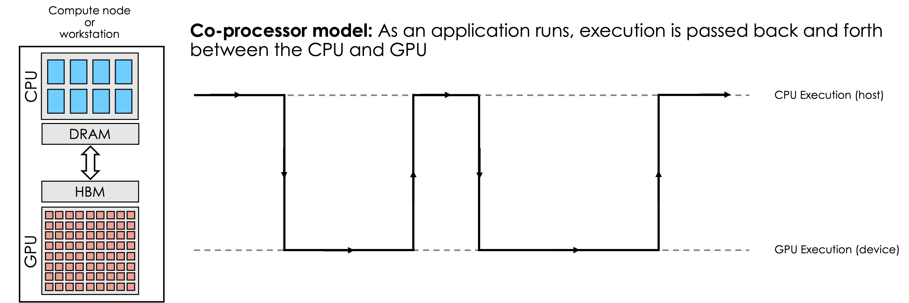
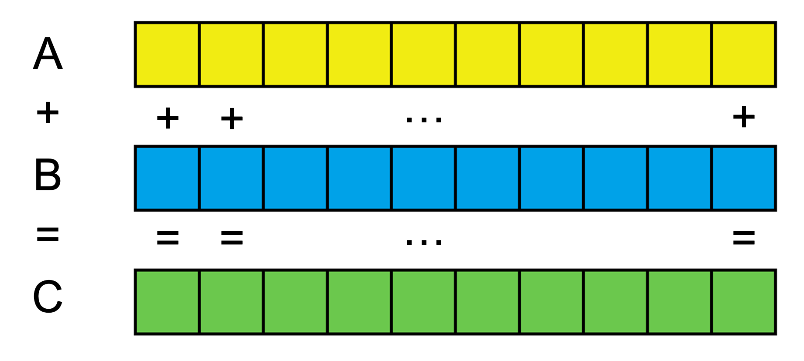
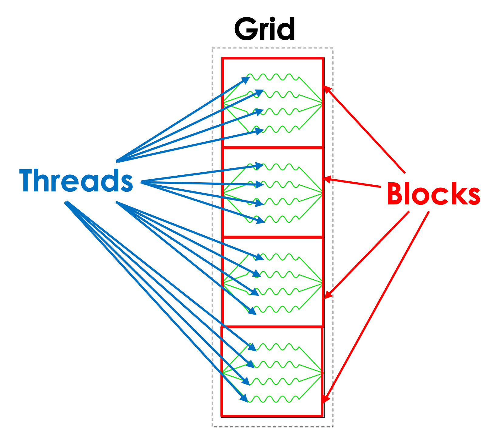
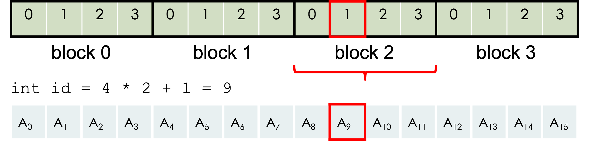

# A Brief Introduction to GPU Programming

*Verónica Melesse Vergara & Tom Papatheodore (Oak Ridge Leadership Computing Facility - OLCF)*

This repository is part of the Tapia 2022 DOE National Laboratories HPC session. It includes the following components:

* `examples` - contains codes that are demonstrated as part of the self-guided tutorial.
* `exercises` - contains hands-on exercises for the participants to perform on their own.
* `common` - contains
  * `setup_environment.sh` - script used to load the necessary programming environment.
  * `hip_translator.h` - header file that tranlates CUDA API calls to HIP API calls (so CUDA can be used on AMD GPUs). 
* `images` - contains the images used in the self-guided `README.md`.

Don't worry much about these components. You'll be guided through the important parts along the way. 

## Getting Started

First things first... 

### Get Access to Spock and Log in

You'll need to get access to [OLCF's Spock compute system](https://docs.olcf.ornl.gov/systems/spock_quick_start_guide.html). To do so, please follow the instructions given by the on-site OLCF staff.

### Clone the Repository

When you log in to Spock, you'll be dropped into your "home" directory (`/ccs/home/<username>` - where `username` will be the `csepXXX` found on the front of your yellow RSA token envelope). From there, clone the repository using the following command:

```bash
$ git clone https://github.com/olcf/tapia2022-intro-gpu-programming.git
```

> NOTES:
> 
> * The `$` above represents the bash command-line prompt and should not be included in the command itself.
> * If you have issues needing a username/password for git, it’s possible you accidentally mis-typed the command above. 

Ok, now you're ready to get started! Move on the next section.


## GPUs vs CPUs

Before getting started on the actual GPU programming stuff, it's important to describe some basic differences between CPUs and GPUs. 

CPUs have multiple cores (maybe 1 to 64 cores) with high clock rates, a hierarchy of caches, and advanced instructions sets - making them very fast at executing single (to a handful of) execution streams. GPUs on the other hand have 1000s of cores, and although the cores are typically slower individually than CPU cores, the sheer number of cores makes them very good at compute throughput (the amount of calculations that can be performed at the same time). Another important point to mention is that CPUs and GPUs have their own physical memories. CPUs have access to DRAM and GPUs have access to high-bandwidth memory (HBM), the latter of which has (as its name implies) higher bandwidth than DRAM. This means, as we'll see in the next section, that data needs to be passed back and forth between the CPU and GPU throughout a program. For example, if you allocate and initialize an array of values on the CPU, the GPU has no idea about those values - or the existence of the array at all (since the GPU has a completely separate memory from the CPU).


## GPU Programming

GPU programming can be accomplished with many different programming models (CUDA, HIP, OpenMP offload, OpenACC, etc.), but all models follow a co-processor model as shown in the image below. The basic idea is that both a CPU (often called the "host") and a GPU (often called the "device") are used and execution is passed back and forth between the CPU and GPU throughout the program. 

Execution starts on the CPU, perhaps doing some intialization (e.g., allocating CPU and GPU memory, initializing values, etc.). Then, when a compute-intensive region of the program is encountered, execution (and any relevant data) is passed to the GPU so calculations can be performed very quickly (since GPUs have very high compute throughput and HBM bandwidth). Generally speaking, once the desired results are found from the GPU calculations, the results can be sent back to the CPU. From there, execution continues on the CPU until another compute-intensive part of the code is reached and  so on. 

> NOTE: Computations and data accesses (from GPU memory) are VERY fast on GPUs, often making the data transfers to and from the GPU the bottleneck in performance - so making data live on the GPU for as long as possible is a common theme in performance optimizations. 



## Example: Vector Addition

Vector addition is essentially the "Hello, World!" of GPU programming. If you're not familiar with vector addition, the idea is simple. You have 2 vectors (or arrays) of values and you add them element-by-element. So in the image below, `A[1]` (element 1 of vector A) + `B[1]` (element 1 of vector B) = `C[1]` (element 1 of vector C) - and similar for all other elements in the arrays. So each element-wise addition is completely independent from the other elements.

<center></center>

> NOTE: Vector and array might be used interchangeable throughout this tutorial, but they mean the same thing - so don't let that confuse you.

An outline of a GPU vector addition code would look as follows:

```c
int main(){
  // Allocate memory for array on host
  // Allocate memory for array on device
  // Fill array on host
  // Copy data from host array to device array
  // Do something on device (e.g. vector addition)
  // Copy data from device array to host array
  // Check data for correctness
  // Free Host Memory
  // Free Device Memory
}
```

In the following sub-sections, we'll look at how each of the individual parts of the outline are actually coded up. By doing so, we'll eventually arrive at the full program included in this repository (`examples/vector_addition/vector_addition.cu`). 

### Allocate memory for array on host

In the C vector addition code, this would look as follows:

```c
    // Allocate memory for array on host
    size_t bytes = N*sizeof(double);
    double *A = (double*)malloc(bytes);
    double *B = (double*)malloc(bytes);
    double *C = (double*)malloc(bytes); 
```

This is nothing beyond just normal C programming.

### Allocate memory for array on device

```c
    // Allocate memory for array on device
    double *d_A, *d_B, *d_C;
    cudaMalloc(&d_A, bytes);
    cudaMalloc(&d_B, bytes);
    cudaMalloc(&d_C, bytes);   
```

where the `cudaMalloc` API call looks like this:

```c
cudaError_t cudaMalloc( void** devPtr, size_t size )
```

### Fill array on host

```c
    // Fill array on host
    for(int i=0; i<N; i++)
    {
        A[i] = 1.0;
        B[i] = 2.0;
        C[i] = 0.0;
    }  
```

Nothing to see here but C programming : )

### Copy data from host array to device array

```c
    // Copy data from host array to device array
    cudaMemcpy(d_A, A, bytes, cudaMemcpyHostToDevice);
    cudaMemcpy(d_B, B, bytes, cudaMemcpyHostToDevice);
```

where the `cudaMemcpy` API call look like this

```c
cudaError_t cudaMemcpy( void* dst, const void* src, size_t count, cudaMemcpyKind kind )
```

Notice here that the "source" memory buffer (`src`) is the CPU buffer (`A`) and the "destination" memory buffer (`dst`) is the GPU buffer since we are sending data from the CPU to the GPU.

### Do something on device (e.g. vector addition)

We'll come back to this part soon since it differs from the CUDA API calls we've been dealing with up to this point. Stay tuned...

### Copy data from device array to host array

```c
    // Copy data from device array to host array
    cudaMemcpy(C, d_C, bytes, cudaMemcpyDeviceToHost);
```

Notice here that the "source" memory buffer (`src`) is the GPU buffer (`d_C`) and the "destination" memory buffer (`dst`) is the CPU buffer since we are sending data from the GPU to the CPU.

### Check data for correctness

```c
    // Check data for correctness
    double tolerance = 1.0e-14;
    for(int i=0; i<N; i++)
    {
        if( fabs(C[i] - 3.0) > tolerance )
        {
            printf("Error: value of C[%d] = %f instead of 3.0\n", i, C[i]);
            exit(1);
        }
    }
```

### Free Host Memory

```c
    // Free Host Memory
    free(A);
    free(B);
    free(C); 
```

Again, just C programming here.

### Free Device Memory

```c
    // Free Device Memory
    cudaFree(d_A);
    cudaFree(d_B);
    cudaFree(d_C);
```

where the CUDA API call looks like this

```c
cudaError_t cudaFree( void* devPtr )
```

### GPU Thread, Block, Grid Hierarchy

Now, before looking at the GPU kernel (this really just means a GPU function), it's helpful to understand how the GPU threads are launched. Instead of just a large number of threads, a "grid" of threads is spawned, where the threads are partitioned into "blocks" as shown in the image below. And threads within a block can cooperate when performing calculations.


<center></center>

Using the notation in the vector addition program, the grid in this image would be created from:

```c
N           = 16;
thr_per_blk = 4;
blk_in_grid = ceil(float(N) / thr_per_blk);
```

where `N` is the number of elements in the arrays, `thr_per_blk` is the number of threads within each grid block, and `blk_in_grid` is the number of grid blocks within the grid.

### GPU Kernel Function

Ok, now let's take a look at the GPU kernel. We already said it's just a function that runs on the GPU, but how is it different than a normal function? 

> NOTE: Hang in there. We're almost to the hands-on parts : )

Here is an example of a serial function in C that performs a vector addition:

```c
void vector_addition(double *a, double *b, double *c){
    for (int i=0; i<N, i++){
        c[i]= a[i] + b[i];
    }
}
```

In this serial case, a single process iterates through the loop and adds the vectors element-by-element (sequentially).

A GPU kernel function performing the same task would look as follows:

```c
__global__ void vector_addition(double *a, double *b, double *c)
{
  int id = blockDim.x * blockIdx.x + threadIdx.x;
  if (id < N) c[id] = a[id] + b[id];
}
```

In this case, there is no loop! All GPU threads run the same kernel function, but each thread is assigned a unique global ID to know which element(s) to calculate. The arguments to the kernel (`a`, `b`, and `c`) are GPU buffers that were allocated with `cudaMalloc`. `id` defines a unique thread ID among all threads in the grid. This unique ID actually deserves a bit more explanation to fully understand...

`blockDim` gives the number of threads within each block (x-dimension for 1D) - in our image above, `blockDim = 4` since there are 4 threads per block. `blockIdx` specifies the block index of the thread (within the grid of blocks) - in our image above the range of values `blockIdx` can have is `0-3` since there are 4 blocks in the grid. `threadIdx` specifies a thread’s local ID within a thread block - in our image above, `threadIdx` can have values `0-3` since there are 4 threads per block.

To make this concrete, let's take a look at an example. If `blockIdx.x = 2` and `threadIdx.x = 1`, the unique thread ID (and so the element of the array) would be `9` as shown in the diagram below.

<br />

<center></center>

And the last thing to point out is the `if(id < N)` line. This is included to make sure we don't try to calculate values outside of the memory we allocated for the array in GPU memory. For example, what if we had `N = 15` instead of `N = 16`, so that...

```c
N           = 15;
thr_per_blk = 4;
blk_in_grid = ceil(float(N) / thr_per_blk);
```

In this case, `blk_in_grid = ceil(3.75)= 4`, so you still have 4 blocks of 4 threads, but 1 of those threads isn't needed, as shown in the image below. If we accidentally perform the calculation on that  last element, we would be reading values with undefined values and worse, we would be writing to memory that doesn't belong to us!

<br />

<center></center>

### Launching the Kernel

Ok, so how do we launch the kernel? Well, there is actually special syntax for a GPU kernels as shown below.

```c
kernel_name<<<num_blocks_in_grid, num_threads_in_block>>>(<arg0>, ...);
```

where 

* `kernel_name` is the user-defined name of the kernel.
* `num_blocks_in_grid` is the number of blocks in the grid.
* `num_threads_in_block` is the number of threads in each block.
* `arg0, arg1,` etc. are the kernel function arguments.

For our specific example, we would have 

```c
vector_addition<<<blk_in_grid, thr_per_blk>>>(d_a, d_b, d_c);
```

So, the only unique thing about this "triple-chevron" notation is the chevrons themselves (i.e, the `>`s) and the arguments they surround.

### Example 1: Vector Addition

Ok, enough descriptions. Let's run the code. To do so, ...

1) Navigate to the repository directory:

```bash
$ cd tapia2022-intro-gpu-programming
```

2) Set up the programming environment:

```bash
$ source common/setup_environment.sh
```

3) Navigate to the vector addition program directory:

```bash
$ cd examples/vector_addition
```

4) Compile the code:

```bash
$ make
```

5) Once you have compiled your code, submit a batch job:

```bash
$ sbatch submit.sh
```

You can check the status of your running job with:

```bash
$ squeue -u <username>
```

Once your job has finished, check that it ran successfully by looking for the string `__SUCCESS__` in your stdout file from the job. You will also see the values of `N`, `thr_per_blk`, and `blk_in_grid`. Nice job! You ran the program on one of Spock's GPUs!

Now, what happens if you change `N` to be too large?

6) Change `N` to `5e9` to see what happens:

```bash
$ vim vector_addition.cu
```

7) Recompile the code:

```bash
$ make clean
$ make
```

6) Once you have recompiled your code, submit a batch job:

```bash
$ sbatch submit.sh
```

> NOTE: Don't worry if you don't understand what happened. We'll look at error checking next and revisit this last part.

## CUDA Error Checking

Error checking is a relatively easy way of adding some debugging information into your code. There are 3 main types of CUDA errors:

* Errors from CUDA API calls

* Synchronous CUDA kernel errors
    * These errors are related to the kernel launch

* Asynchronous CUDA kernel errors
    * These errors are related to the kernel execution

CUDA API calls return a `cudaError_t` value that can be checked. Its value will either be `cudaSuccess` or an error. A simple method of checking CUDA API errors could be as follows:

```c
int main()
{
    ...

    cudaError_t gpuErr;

    gpuErr = cudaMalloc(&d_A, bytes);

    if(cudaSuccess != gpuErr){
        printf(”GPU Error - %s\n”, cudaGetErrorString(gpuErr));
        exit(1);
    }

    ...

}
```

In this example, the error value is captured in `gpuErr`. If the value isn't `cudaSuccess`, the value is passed to `cudaGetErrorString` to change the value into a human-readable string with a (hopefully) useful message. While this is an ok way to perform error checking, a much more common way is to turn this into an error checking macro so it can be used throughout your code. Here is an example:

```c
// Macro for checking errors in GPU API calls
#define gpuErrorCheck(call)                                                                  \
do{                                                                                          \
    cudaError_t gpuErr = call;                                                               \
    if(cudaSuccess != gpuErr){                                                               \
        printf("GPU Error - %s:%d: '%s'\n", __FILE__, __LINE__, cudaGetErrorString(gpuErr)); \
        exit(1);                                                                             \
    }                                                                                        \
}while(0)

// Main program
int main()
{
    ...

    gpuErrorCheck( cudaMalloc(&d_A, bytes) );
    ...

    return 0;
}
```

CUDA kernel errors can result from kernel launch and/or kernel execution. Synchronous errors are caused by errors in the kernel *launch* (e.g., invalid execution parameters) and are found by calling `cudaGetLastError()` (since CUDA kernels don't actually return anything). Asynchronous errors are caused by kernel *execution* (e.g., invalid memory access) and are found by calling `cudaDeviceSynchronize()` (since kernel execution is asynchronous with respect to the CPU). So the error checking macro could be used as follows:

```c
// Launch kernel
vector_addition<<<blk_in_grid, thr_per_blk>>>(d_A, d_B, d_C);

// Check for synchronous errors during kernel launch (e.g. invalid execution paramters)
gpuErrorCheck( cudaGetLastError() );

// Check for asynchronous errors during GPU execution (after control is returned to CPU)
gpuErrorCheck( cudaDeviceSynchronize() );
```

> NOTE: `cudaDeviceSynchronize` can cause a performance penalty so you might want to surround it with a debug flag.

### Example 2: Vector Addition with Error Checking

With proper error checking in place, let’s retry our test from Example 1...

Recall from Example 1, we were trying to answer the question “what happens if you change `N` to be too large?”

1) Navigate to the directory 

```bash
$ cd tapia2022-intro-gpu-programming/examples/vector_addition_with_error_check
```

2) Change `N` to `5e9` to see what happens:

```bash
$ vim vector_addition.cu
```

3) Compile the code:

```bash
$ make
```

4) One you have compiled your code, submit a batch job:

```bash
$ sbatch submit.sh
```

5) Once your job has finished, check for an error message in your stdout file. Why did this job fail?


## Exercises

Ok, now it's time to test your knowledge of what you just learned. Feel free to ask the on-site OLCF staff for help along the way.

### Exercise 1: Find the Error

In this exercise, you will compile and run a vector addition program that includes error checking to try to figure out what is wrong with the program. Using the reported error message, your task is to identify the problem and fix it.


1) Navigate to the directory

```bash
$ cd tapia2022-intro-gpu-programming/exercises/vector_addition_find_the_error
```

2) Then compile the code

```bash
$ make
```

3) Once you have compiled your code, submit a batch job:

```bash
$ squeue submit.sh
```

4) Once your job has finished, look for an error message in the stdout file and use the error (as well as the source code in `vector_addition.cu`) to identify the problem. 

5) Then fix the problem (in `vector_addition.cu`), recompile the code (`make`), and re-run it (`squeue submit.sh`).

6) If the new stdout file reports `__SUCCESS__`, the problem has been solved.

### Exercise 2: Complete the Kernel

In this exercise, you are given a program that simple squares all the values of an array on a GPU, bu the kernel function is missing the actual calculation. Your task is to add it.

1) First, navigate to the directory

```bash
tapia2022-intro-gpu-programming/exercises/square_array_elements_complete_the_kernel
```

2) The file `square_array_elements.cu` contains a program which simply takes an array and squares each of the elements on the GPU. However, the “squaring of the array elements” is missing from the GPU kernel. Add the missing calculation in the square_array_elements.cu file.

3) Then compile the code:

```bash
$ make
```

4) Once you have compiled your code, submit a batch job:

```bash
$ squeue submit.sh
```

5) If the new stdout file reports `__SUCCESS__`, you have correctly added the missing calculations.

### Exercise 3: Complete the Data Transfers

In this exercise, you are given a program that computes the average value of each element of an array (where the average is calculated from the element and its 3 neighbors on both sides - so 7 elements total are used in the average). However, the CUDA API calls for performing the data transfers (1 from the CPU to the GPU and 1 from the GPU to the CPU) are incomplete. Your task is to add in the correct CPU and GPU buffers.

1) First, navigate to the directory

```bash
$ cd tapia2022-intro-gpu-programming/exercises/average_array_elements_complete_the_data_transfers
```

2) Add in the correct CPU and GPU buffers to the 2 `cudaMemcpy` calls.

3) Then compile the code

```bash
$ make
```

4) Once you have compiled your code, submit a batch job:

```bash
$ squeue submit.sh
```

5) If the new stdout file reports `__SUCCESS__`, you have correctly added the missing arguments (buffers).

In addition to the complete-the-data-transfers task, this program also shows a comparison of CPU vs GPU performace. It mimics a more realistic application by performing a stencil operation (i.e., using multiple contiguous array elements, rather than just single element like all previous examples/exercises) over multiple time steps. 

## Where to Go From Here?

We really only scratched the surface here. If you’d like to learn more about CUDA programming, the following are great resources:

* NVIDIA’s CUDA Training Series: [https://www.olcf.ornl.gov/cuda-training-series/](https://www.olcf.ornl.gov/cuda-training-series/) 

* NVIDIA’s CUDA Programming Guide: [https://docs.nvidia.com/cuda/cuda-c-programming-guide/index.html](https://docs.nvidia.com/cuda/cuda-c-programming-guide/index.html) 

If you’re interested to learn more about the Oak Ridge Leadership Computing Facility (OLCF), you can visit the following links:

* OLCF Website: [https://www.olcf.ornl.gov/](https://www.olcf.ornl.gov/)
 
* OLCF Documentation: [https://docs.olcf.ornl.gov/](https://docs.olcf.ornl.gov/)
 
* NCCS Job Opportunities (search for “nccs”): [https://jobs.ornl.gov/](https://jobs.ornl.gov/)

<hr /> 


